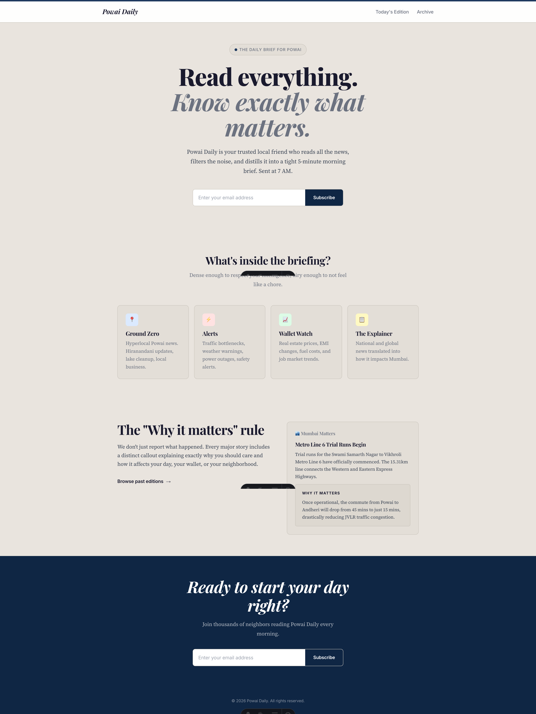
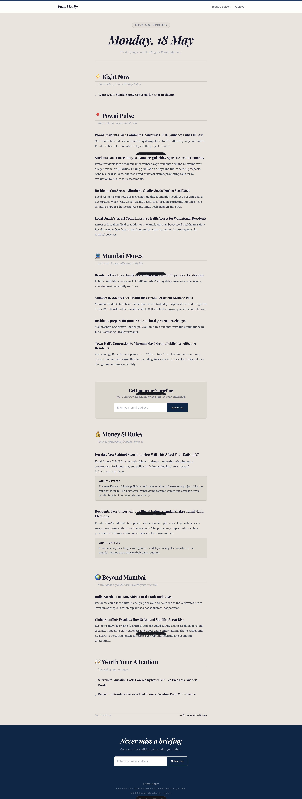

# Brief Engine

[](https://www.apache.org/licenses/LICENSE-2.0)
[](https://www.python.org/)
[](https://docs.astral.sh/uv/)
[](https://ollama.com/)
[](https://astro.build/)

> An open-source local intelligence engine that turns noisy news information into structured, high-signal briefs — running entirely on local compute.

Brief Engine ingests multi-source RSS feeds, extracts named entities and semantic embeddings, clusters related coverage across sources, ranks stories by reader impact and recency, and generates concise editorial editions using local LLMs. No cloud API keys or external data egress required.

```text
Feeds → Ingest & Filter → NLP Enrich → Cluster → Rank → Summarise → Publish
```

## The Problem

Following news on the web is full of noise.
You monitor multiple feeds, publications, and channels with the intention of staying informed. But by the time you scan dozens of articles, it is not always clear what actually happened, what was merely syndicated re-reporting, or how any of it impacts you.

The problem is not a lack of information. It is the friction around distilling it.

When multiple outlets report the same event, you read redundant text without gaining new signal. When automated summarizers exist, they rely on expensive cloud APIs with privacy tradeoffs. And when you finish reading, headlines rarely answer the question that matters most to a resident or reader: *how does this affect my daily life, costs, or commute?*

The result is information fatigue: you spend time consuming volume without necessarily gaining clarity.

## The Solution

The goal is not to collect more headlines. It is to make news consumption intentional.
Brief Engine is built around the idea that signal extraction should be deterministic, local, and focused on reader impact.

It sits between raw syndication feeds and your reading routine: grouping related coverage across publishers, prioritizing stories by real-world relevance and recency, and synthesizing concise editions without relying on paid APIs or external servers.

The name Brief Engine reflects the core idea: **turn noisy information into actionable intelligence, then deliver it in under five minutes.**

## What it does

- 📰 Ingests RSS feeds across configurable geographic scopes with content normalization and sanitization
- 🧠 Enriches articles with named entities and semantic embeddings
- 🔗 Clusters related reporting across sources using semantic similarity
- 📊 Ranks story clusters using relevance, recency, coverage volume, and publisher diversity
- ✍️ Summarises events using local quantized LLMs through Ollama with structured output
- 🗂️ Assembles editorial editions through configurable section templates and content formats
- 📝 Publishes structured Markdown editions for Astro static site generation
- 🤖 Runs locally with SQLite, Ollama, spaCy, and scikit-learn — no paid API keys

## Built for

- Hyperlocal and neighborhood newsletter publishers (e.g., *Powai Pulse*)
- Developers and engineers seeking a clean, production-grade local NLP and clustering reference
- Anyone monitoring community, civic, or industry news who wants signal without noise
- Privacy-conscious teams and users who do not want content sent to external APIs

## Engineering Highlights

- Local-first AI — Ollama with quantized Qwen 3 8B; no cloud dependency, zero API cost, zero data egress
- Story signature embeddings — Entity-guided signatures (`spaCy` NER + text) encoded via `all-MiniLM-L6-v2` into 384-d L2-normalized vectors
- Unsupervised clustering — Cosine Agglomerative Clustering with dynamic thresholding and unit-normalized centroid calculation
- Mathematical ranking — Composite scoring combining exponential recency half-life ($e^{-\Delta t / 24}$), coverage volume, and source diversity
- Structured AI output — Low-temperature inference with strict JSON schema constraints and defensive validation fallbacks
- Declarative edition engine — Configuration-driven section matching, priority weighting, and per-category deduplication caps
- Polymorphic format dispatch — Dynamic generation of leads ("Why it matters"), explainers, short digests, and alert chips
- Relational persistence — SQLite in WAL mode with binary vector BLOBs and indexing for high-throughput batch operations
- Decoupled SSG publishing — Idempotent Markdown export to Astro Content Collections validated with type-safe Zod schemas
- Modular pipeline design — Clear separation of ingestion, NLP enrichment, clustering, LLM synthesis, and static web serving

## Tech stack

| Layer | Technology |
|---|---|
| Ingestion & Normalization | `feedparser`, regex sanitization |
| NLP & Entity Extraction | `spaCy` (`en_core_web_sm`) |
| Embeddings & Clustering | `sentence-transformers` (`all-MiniLM-L6-v2`), `scikit-learn` (`AgglomerativeClustering`) |
| Local AI | `ollama` (Qwen 3 8B Q4_K_M) |
| Storage | `sqlite3` (WAL mode, binary BLOBs) |
| Presentation & Delivery | Astro 5, TypeScript, Markdown Content Collections |

## Screenshots

### Landing page



### Sample edition



## Getting started

### Prerequisites

- Python 3.12+
- [uv](https://docs.astral.sh/uv/) for dependency management
- Node.js 18+
- [Ollama](https://ollama.com) running locally

### Pull local model

```bash
ollama pull qwen3:8b-q4_K_M
```

### Install and run

```bash
git clone https://github.com/deepak-terse/brief-engine
cd brief-engine
uv sync
uv run start
uv run publish
```

To launch the static reader website:

```bash
cd website
npm install
npm run dev
```

The site will be available at:

```text
http://localhost:4321
```

## Documentation

| Document | What it covers |
|---|---|
| [Architecture](docs/ARCHITECTURE.md) | System design, component structure, clustering mechanics, and storage schema |
| [Implementation](docs/IMPLEMENTATION.md) | Feature-level flows, algorithmic formulas, LLM constraints, and tradeoffs |

## License

MIT — open source for learning, experimentation, and personal productivity.

---

Built to make information more useful, not just more available.
